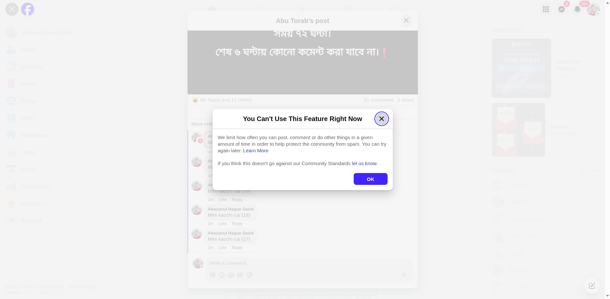

# Facebook Auto Comment Bot

An **automated commenting tool** for Facebook using Python and Selenium. Seamlessly post comments on Facebook posts automatically. Ideal for social media managers, marketers, and anyone seeking auto comment functionality.

---

## Features

- 🚀 **Auto comment** on any Facebook post
- 🔧 **Easy setup** with Python & pip
- 🌐 **Selenium WebDriver** browser automation
- ✏️ **Customizable comments** and targeting
- 🤖 Designed for **social media automation**

---

## Keywords

`auto comment`, `facebook auto comment`, `automatic comment`, `facebook bot`, `selenium python facebook`, `social media automation`, `auto reply facebook`

---

## Installation & Setup

### 1. Prerequisites
- Python 3.6 or higher
- pip (Python package manager)

### 2. Install Dependencies

```bash
pip install selenium
```

### 3. Download Chrome WebDriver

- Download from [https://chromedriver.chromium.org/](https://chromedriver.chromium.org/)
- Make sure the ChromeDriver version matches your Chrome browser version.

### 4. Configure the Script

- Open the Python script (`AutoComment_chrome.py` or `AutoComment_chromium.py`).
- **Set the target Facebook post URL at line 66/83** in the script.
- **Set your comment(s) at line 100/125** in the script.

### 5. Run the Bot

```bash
python AutoComment_chrome.py
```
*or*
```bash
python AutoComment_chromium.py
```

### 6. Facebook Login
- After running the script, enter your Facebook **Email/Phone** and **Password** within 40 seconds (when prompted).

---

## How to Use

1. **Copy the target Facebook post URL.**
2. **Open the script and set your desired comment(s) and post URL** as indicated above.
3. **Run the Python script.**
4. **Enter your Facebook login credentials when prompted.**
5. **The bot will automatically comment on the given post.**

---

## Troubleshooting

### If you encounter the error below, please wait and try again later.



**Common Reasons:**
- Facebook detects automated activity
- Rate limiting or a temporary block by Facebook
- Network or browser driver issues

**Solutions:**
- Wait 10-15 minutes before retrying
- Check or update your ChromeDriver version
- Ensure your internet connection is stable

---

## Disclaimer

This auto comment bot is for educational purposes only. Please respect Facebook’s [Terms of Service](https://www.facebook.com/terms.php). Excessive or inappropriate use may lead to Facebook account restrictions or bans.

---

## Tags

`#AutoComment` `#FacebookAutomation` `#SocialMediaBot` `#PythonAutomation` `#SeleniumBot`

---
